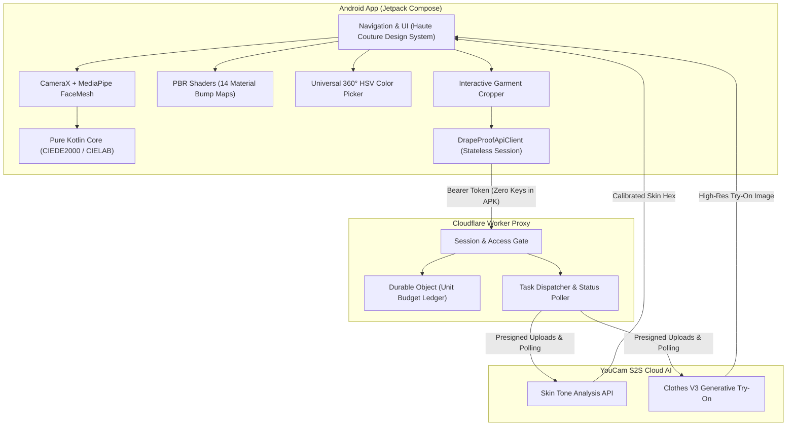

# DrapeIt ✨

**Personal Colorimetry, Real-Time AR Virtual Drape & AI Virtual Try-On Studio**

[](https://kotlinlang.org)
[](https://developer.android.com/jetpack/compose)
[](https://www.perfectcorp.com)
[](LICENSE)

DrapeIt is an Android digital styling platform that solves a fundamental e-commerce question: **"Will this exact fabric, material, and color actually flatter my complexion before I buy?"**

By fusing **on-device CameraX & MediaPipe FaceMesh tracking**, **dual-layer luminance-preserving PBR fabric shaders**, and **YouCam S2S Cloud AI (Clothes V3 & Skin Tone Analysis)**, DrapeIt allows users to test real luxury fabrics, adjust any color across a 360° spectrum, and generate photorealistic virtual try-ons.

---

## 🌟 Key Features

### 1. 🪞 Real-Time AR Live Drape Studio
* **Anatomical FaceMesh Tracking:** Uses MediaPipe on-device face mesh landmarks (chin anchor point 152) to project a tailored virtual cloth drape across the user's chest in real time.
* **Jitter-Free Exponential Smoothing:** Implements a low-pass filter ($\alpha = 0.28$) on landmark coordinates, removing camera shake and giving virtual cloth realistic, stable weight.
* **Instant Harmony Scoring:** Real-time colorimetry engine computes CIEDE2000 contrast separation and evaluates tone harmony dynamically as lighting changes.

### 2. 🧵 Physically-Based Procedural Fabric Shaders
DrapeIt features a **4-pass luminance-preserving texture engine** across **14 real-world materials**:
1. **Mulberry Silk** — Micro-directional filament weave with anisotropic specular sheen
2. **Lustrous Satin** — Liquid gloss reflections and ultra-smooth highlights
3. **Genuine Leather** — Cellular Voronoi grain, fine micro-creases, and edge highlights
4. **Heritage Tweed** — Herringbone zig-zag bouclé cross-hatching with raised slub flecks
5. **Plush Corduroy** — 8-wale vertical parallel cord ridges with deep shadow valleys
6. **Natural Linen** — Organic irregular slub crosshatch with coarse fiber threads
7. **Structured Denim** — 45° 3x1 twill diagonal ribs with weft yarn cross-texture
8. **Plush Velvet** — Dense micro-pile nap with inverted Fresnel light absorption
9. **Pure Cashmere** — Brushed cloud fuzz and gentle micro-fleece nap
10. **Merino Wool** — Worsted interlocking yarn loop knit
11. **Sheer Chiffon** — Featherlight translucent grid with light pass-through
12. **Ribbed Knit** — 2x2 vertical ribbed knit channels with wale relief
13. **Organic Cotton** — Classic soft plain basketweave
14. **Tech Polyester** — Technical micro-piqué athletic honeycomb mesh

### 3. 🎨 Universal 360° HSV Color Picker (16.7M Colors)
* **Unrestricted Palette Freedom:** Full 360° Hue spectrum slider with Saturation and Value adjustment.
* **Direct Hex Input:** Real-time `#RRGGBB` hex code parser with validation and live preview swatch.
* **Curated Seasonal Swatches:** 1-tap presets (Royal Burgundy, Cobalt Navy, Deep Emerald, Terracotta, Midnight Charcoal, Amber Ochre, etc.).

### 4. ✂️ Interactive On-Device Garment Cropper & Normalizer
* **Compose-Native Viewport:** Pinch-to-zoom, pan, rotate 90°, and 3:4 portrait crop guides to isolate clothes from e-commerce screenshots, hangers, or model photos.
* **White-Canvas Normalization:** Automatically flattens cropped garments onto a clean white background with padding and optimizes export quality for cloud fitting.

### 5. 📸 Photorealistic AI Virtual Try-On (YouCam Clothes V3)
* **Cloud VTO Integration:** Securely uploads user avatars and cropped garments to YouCam's `/s2s/v2.0/task/cloth-v3` API via a secure backend proxy.
* **Virtual Wardrobe Gallery:** Saves fitted outfits, allows high-resolution fullscreen inspection, and direct photo export to the device gallery.

### 6. ⚖️ Photo Compare Studio
* Multi-select 2 to 4 captured looks in a side-by-side comparison grid.
* Displays match score percentiles, fabric details, and visual contrast indicators.

---

## 🏗️ Architecture Overview



---

## 🚀 Build & Installation

### Prerequisites
* **Java 17+ JDK**
* **Android SDK** (API 26+)
* Android device or emulator

### 1. Build and Run Unit Tests
```bash
cd android
./gradlew test assembleDebug
```
*(On Windows PowerShell: `.\gradlew.bat test assembleDebug`)*

The debug APK is generated at:
`android/app/build/outputs/apk/debug/app-debug.apk`

### 2. Install on Android Device
```bash
adb install -r android/app/build/outputs/apk/debug/app-debug.apk
```

---

## 🔒 Security & Privacy
* **Zero API Keys in APK:** The Android application never bundles or stores master YouCam API keys. All cloud operations use short-lived session tokens through the secure Cloudflare Worker proxy.
* **On-Device First:** Camera frames and facial landmarks stay completely local on the device during live colorimetry and AR draping. Photos are only uploaded to YouCam when the user explicitly triggers an AI Try-On or Skin Tone analysis task.

---

## 📄 License
This project is licensed under the [MIT License](LICENSE).
