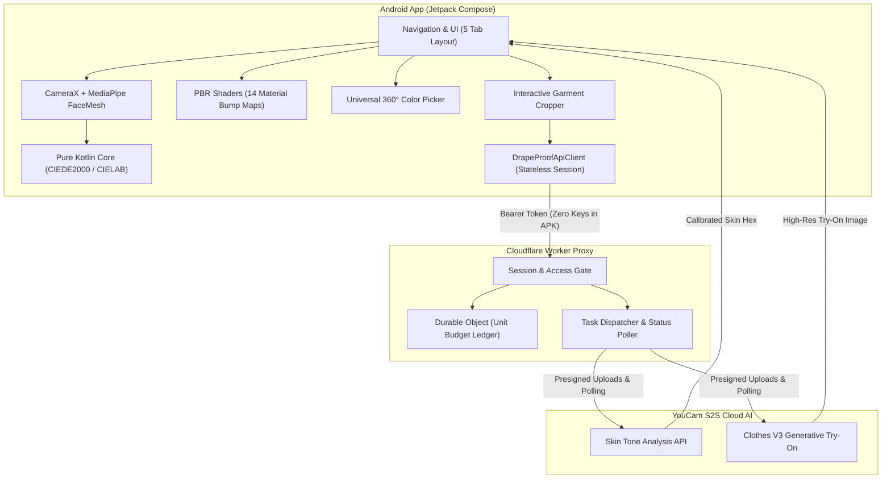

# DrapeIt ✨

**Personal Colorimetry, Real-Time AR Virtual Drape & AI Virtual Try-On Studio**

[](https://kotlinlang.org)
[](https://developer.android.com/jetpack/compose)
[](https://www.perfectcorp.com)
[](LICENSE)

DrapeIt is an Android digital styling application that answers a key shopping question: **"Will this exact fabric, texture, and color actually flatter my complexion before I buy?"**

By combining **on-device CameraX & MediaPipe FaceMesh tracking**, **physically-based procedural fabric shaders (PBR)**, and **YouCam S2S Cloud AI (Clothes V3)**, DrapeIt lets users test real luxury fabrics in real time, explore any color across a 360° spectrum, and generate photorealistic virtual try-ons.

---

## 🧭 Evaluation & Testing Guide for Judges

For a 5-minute walkthrough of all features and direct installation instructions, see the **[Judge Testing & Evaluation Guide](docs/JUDGE_TEST_GUIDE.md)**.

---

## 🌟 Core Features

### 1. 🪞 Real-Time AR Live Drape Studio
* **Anatomical FaceMesh Tracking:** Uses MediaPipe on-device face mesh landmarks (chin anchor point 152) to project a tailored virtual cloth drape across the user's chest in real time at 60 FPS.
* **Jitter-Free Exponential Smoothing:** Implements a low-pass filter ($\alpha = 0.28$) on landmark coordinates, removing camera shake and giving virtual cloth a natural drape.
* **Instant Harmony Scoring:** Real-time colorimetry engine computes CIEDE2000 contrast separation and evaluates tone harmony dynamically as lighting changes.
* **Static Photo Mode:** Upload any portrait from the gallery to run one-shot MediaPipe pixel analysis.

### 2. 🧵 Physically-Based Procedural Fabric Shaders
DrapeIt features a multi-pass luminance-preserving texture engine across **14 real-world materials**:
1. **Mulberry Silk** — Micro-directional filament weave with anisotropic specular sheen
2. **Lustrous Satin** — Liquid gloss reflections and ultra-smooth highlights
3. **Genuine Leather** — Cellular Voronoi grain, fine micro-creases, and edge highlights
4. **Heritage Tweed** — Herringbone zig-zag bouclé cross-hatching with raised slub flecks
5. **Plush Corduroy** — 8-wale vertical parallel cord ridges with deep shadow valleys
6. **Natural Linen** — Organic irregular slub crosshatch with coarse fiber threads
7. **Structured Denim** — 45° 3x1 twill diagonal ribs with weft yarn cross-texture
8. **Plush Velvet** — Dense micro-pile nap with inverted Fresnel light absorption
9. **Pure Cashmere** — Brushed cloud fuzz and gentle micro-fleece nap
10. **Merino Wool** — Worsted interlocking yarn loop knit
11. **Sheer Chiffon** — Featherlight translucent grid with light pass-through
12. **Ribbed Knit** — 2x2 vertical ribbed knit channels with wale relief
13. **Organic Cotton** — Classic soft plain basketweave
14. **Tech Polyester** — Technical micro-piqué athletic honeycomb mesh

### 3. 🎨 Universal 360° Color Spectrum (16.7M Colors)
* **Full Spectrum Freedom:** 360° Hue spectrum slider with Saturation and Value adjustment.
* **Direct Hex Input:** Real-time `#RRGGBB` hex code parser with instant preview.
* **Fabric Preservation:** Material weave and highlights remain tangible and sharp under any chosen color without flat color overlay degradation.

### 4. 👤 Profile & Real-Time Colorimetric Calibration
* **15-Frame Sliding-Window Stability Test:** Measures color stability across consecutive frames ($\le 1.2\ \Delta E_{00}$) to lock genuine complexion readings without sensor noise.
* **Dynamic Palette Derivation:** Calculates ITA (Individual Typology Angle) and generates **Compatible Palette** and **Contrast Caution** swatches mathematically from real skin tone coordinates.
* **Dual Calibration Entry:** Calibrate via live front camera or pick directly from a clear portrait photo.

### 5. 👗 Virtual Try-On Studio (YouCam Clothes V3 AI)
* **Guided 2-Step Workflow:**
  - **Box 1 (Upload Person):** Select your model portrait with instant 90° rotation controls.
  - **Box 2 (Upload Garment):** Select clothing and use the built-in 3:4 cropper to pan, zoom, and frame the item.
  - **Step 2 Alternative (Style Mode):** Choose an occasion, silhouette, luxury fabric weave, and color.
* **Neural Fit Generation:** Dispatches the pair to YouCam's `/s2s/v2.0/task/cloth-v3` API via a secure backend proxy and displays the fitted look in a dedicated Studio Result canvas.
* **Instant Export:** Save high-resolution try-on results directly to your phone gallery or to the in-app wardrobe.

### 6. 🧭 Explore & Occasion Styling
* Dynamic styling recommendations across **Daily Wear**, **Formal Work**, **Evening Gala**, and **Weekend Casual**.
* Color palettes and fabric pairings dynamically adapt to your calibrated skin undertone and seasonal profile.

### 7. ✨ Looks & Side-by-Side Compare Studio
* **Wardrobe Gallery:** Masonry feed of saved drape snaps and virtual try-ons with filters for Garment vs. Style try-ons.
* **Photo Compare:** Select 2 to 4 saved looks for side-by-side review with Delta-E contrast metrics and style details.

---

## 🏗️ Architecture Overview



---

## 🚀 Build & Installation for Evaluators / Judges

### Prerequisites
* **Java 17+ JDK**
* **Android SDK** (API 26+)
* Physical Android device or Emulator (API 26+)

### 1. Direct Install Signed Release APK
The project includes a ready-to-test signed release APK:
```bash
adb install -r android/app/build/outputs/apk/release/app-release.apk
```

### 2. Build from Source
```bash
cd android
./gradlew test assembleRelease
adb install -r app/build/outputs/apk/release/app-release.apk
```
*(On Windows PowerShell: `.\gradlew.bat test assembleRelease`)*

The signed release APK is generated at:
`android/app/build/outputs/apk/release/app-release.apk`

---

## 🔒 Security, Privacy & Zero-Leakage Architecture
* **Zero API Keys in APK:** The Android application never bundles or stores private YouCam API keys. All cloud operations communicate through short-lived session tokens via the secure backend proxy.
* **On-Device First:** Camera frames and facial landmarks stay completely in volatile memory during live colorimetry and AR draping. Photos are only uploaded to YouCam when the user explicitly triggers an AI Try-On generation.
* **No Personal Data Stored:** No telemetry, personal names, phone numbers, or analytics are collected or transmitted.

---

## 📄 License
This project is licensed under the [MIT License](LICENSE).
