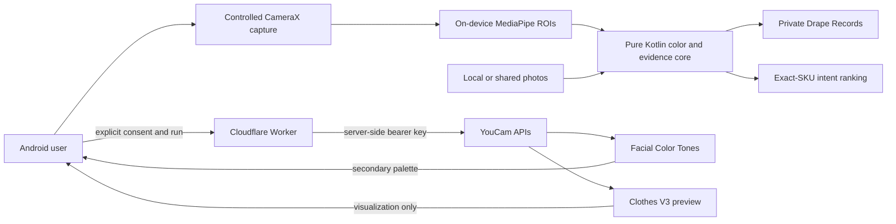

# DrapeProof

**Color evidence, not color rules.**

DrapeProof is an Android-first decision tool for a question that product pages do not answer well: *how strongly will this exact color contrast with my face in the light I am actually standing in?* It measures one real, solid-matte fabric beside the user's face in a controlled camera sequence, explains the result as three separate signals, and ranks color variants of one SKU for the user's chosen `Soft`, `Balanced`, or `Bold` contrast intent.

The product deliberately does **not** assign a season, attractiveness score, diagnosis, or universal “best color.” Generated virtual-try-on pixels are kept separate from measurement evidence.

## Why this is more than a color picker

Phone cameras change exposure and white balance when a cloth enters the frame. A single screenshot can therefore measure the camera's reaction instead of the cloth–face relationship. DrapeProof's live protocol:

1. dims the display to reduce screen color spill;
2. collects 18 stable opening-baseline readings;
3. attempts to lock front-camera auto-exposure and auto-white-balance;
4. collects 18 readings with one solid-matte fabric below the face;
5. removes the fabric and collects 18 closing-baseline readings; and
6. withholds the strongest claim if pose, focus, clipping, temporal stability, control, or baseline-drift gates fail.

The result is a **Contrast Vector**:

- **Cloth–skin separation** — CIEDE2000 distance and signed CIELAB lightness difference.
- **Feature definition** — eyes, eyebrows, and lips measured against captured skin, with a baseline change when available.
- **Apparent face shift** — a camera-recorded cheek/under-chin change, shown only for a passing controlled pair. It is never described as an intrinsic skin-color change.

See [Evidence model](docs/EVIDENCE_MODEL.md) for the exact computation and downgrade rules.

## Product paths

- **Real-cloth scan:** on-device CameraX + MediaPipe capture with opening/drape/closing baselines and hard quality gates.
- **Photo contrast:** locally sample a cheek and fabric from one shared scene, or from separate face and product photos with a clearly lower evidence tier.
- **Exact-color catalog:** rank six demo variants of `DP-MATTE-01` only within that SKU. The current catalog uses screen hex specifications and labels that limitation in every saved record.
- **Drape Records:** retain sampled colors, evidence tier, scoring version, and limitations in private app storage; no live-capture face image is saved.
- **YouCam Lab:** explicit opt-in cloud actions for YouCam Facial Color Tones and the validated Clothes V3 virtual try-on. Picking an image does not upload it; a separate consent checkbox and run action are required. Scarf remains an optional provider that requires private R2 image storage.

The bundled cobalt scarf reference is an original generated demo asset and is excluded from measurement evidence; its hash and provenance are recorded in [`demo-assets/README.md`](demo-assets/README.md).

## Architecture



- [`android/app`](android/app) contains the Compose UI, controlled capture, local photo workflow, storage, catalog, and opt-in YouCam client.
- [`android/core`](android/core) is a platform-independent Kotlin library for sRGB→XYZ→CIELAB conversion, CIEDE2000, robust statistics, gates, evidence policy, ranking, and record validation.
- [`worker`](worker) is a TypeScript Cloudflare Worker that holds the YouCam API key, issues short-lived sessions, validates uploads/tasks, normalizes upstream responses, sends Clothes V3 uploads directly to YouCam, optionally keeps Scarf inputs in R2, and atomically protects paid operations/reserve state in a SQLite-backed Durable Object.

More detail: [Architecture](docs/ARCHITECTURE.md) · [Privacy](docs/PRIVACY.md)

## Build the Android app

Prerequisites:

- Java 17
- Android SDK Platform 36 and Build Tools 36.0.0
- an Android device or emulator with API 26+

From PowerShell:

```powershell
cd android
$env:JAVA_HOME = 'C:\path\to\jdk-17'
$env:ANDROID_HOME = "$env:LOCALAPPDATA\Android\Sdk"
$env:ANDROID_SDK_ROOT = $env:ANDROID_HOME
.\gradlew.bat :core:test assembleDebug
```

The debug APK is produced at `android/app/build/outputs/apk/debug/app-debug.apk`.

The development machine also has an ignored portable JDK under `work/toolchain/jdk17`. To use it without hard-coding its versioned folder:

```powershell
cd android
$repoRoot = (Resolve-Path ..).Path
$javaExe = Get-ChildItem -LiteralPath "$repoRoot\work\toolchain\jdk17" -Recurse -Filter java.exe |
  Where-Object { $_.FullName.EndsWith('bin\java.exe') } |
  Select-Object -First 1 -ExpandProperty FullName
$env:JAVA_HOME = Split-Path (Split-Path $javaExe -Parent) -Parent
$env:Path = "$env:JAVA_HOME\bin;$env:Path"
.\gradlew.bat :core:test assembleDebug
```

To target a deployed Worker, inject its HTTPS origin at build time:

```powershell
.\gradlew.bat assembleDebug -PDRAPEPROOF_API_BASE_URL=https://your-worker.example.workers.dev
```

For an emulator plus local Wrangler, the debug manifest alone permits cleartext loopback:

```powershell
.\gradlew.bat assembleDebug -PDRAPEPROOF_API_BASE_URL=http://10.0.2.2:8787
```

Debug builds without a property use the reserved offline sentinel `https://offline.drapeproof.invalid` and disable cloud actions explicitly. Release builds fail unless `DRAPEPROOF_API_BASE_URL` is a real HTTPS origin; placeholders, localhost, credentials, paths, queries, and fragments are rejected.

## Run the secure Worker

Prerequisites: current Node.js/npm and a YouCam API key.

```powershell
cd worker
npm ci
Copy-Item .dev.vars.example .dev.vars
# Put local secrets in .dev.vars; this file is git-ignored.
npm test
npm run typecheck
npm run dev
```

At minimum, set `YOUCAM_API_KEY`, an independent `SESSION_SECRET`, and `JUDGE_ACCESS_CODE`. Deployment requires the checked-in SQLite-backed `PAID_TASK_LEDGER` Durable Object binding/migration and a Cloudflare KV binding named `DRAPEPROOF_STATE`. The checked-in deployment selects Clothes V3 and therefore does not require R2. Switching to Scarf requires a private R2 Standard bucket bound as `IMAGE_STORE` plus the lifecycle in [`worker/r2-lifecycle.json`](worker/r2-lifecycle.json). See [`worker/.dev.vars.example`](worker/.dev.vars.example), [`worker/wrangler.jsonc`](worker/wrangler.jsonc), and [`worker/README.md`](worker/README.md).

The budget guard is designed for the hackathon credits and current Cloudflare allowances. After live smoke-test reconciliation on 2026-07-18, the Worker starts from the observed 1,018-unit dashboard balance, transactionally protects a 300-unit floor, binds each paid request to a persistent operation ID, queries the account's feature-cost endpoint before admission, and fails closed when cost or persistent state cannot be verified. Set a fresh baseline and `UNIT_BUDGET_ID` from the real dashboard after any out-of-band YouCam usage.

## Verification status

This table is intentionally stricter than “the code exists.” It should be updated only from observed commands or device/API evidence.

| Gate | Current evidence |
|---|---|
| Pure Kotlin core tests | **Passed locally on 2026-07-18:** 30/30 |
| Android build + local tests | **Passed locally on 2026-07-18:** 45/45 (30 core + 15 app); debug and release assembled with the deployed Worker URL |
| Android lint | **Passed locally on 2026-07-18:** debug and release each have 0 fatal/0 errors; 43 non-blocking warnings |
| Signed judge APK | **Produced from current source:** 64,017,523 bytes, SHA-256 `CEDAA97D410C8308EA6F81500E95EBBA0255A8FE5DA6D2FD9E7EA79646CE482E`; RSA-4096, APK v2/v3 verified; physical install still pending |
| Worker unit/integration tests | **Passed locally on 2026-07-18:** 51/51 tests, including canonical session signatures, R2, atomic paid-operation recovery, and the Cloudflare global-fetch binding regression |
| Worker TypeScript typecheck | **Passed locally on 2026-07-18:** `tsc --noEmit` |
| Worker deployment | **Live:** `https://drapeproof-api.drapeproof-abhay.workers.dev`; health `ok`, Clothes V3 configured, KV/paid ledger/access gate ready |
| OnePlus Nord CE6 live capture | **Not yet device-validated** |
| Samsung Galaxy F15 live capture | **Not yet device-validated** |
| Deployed Worker health/session | **Passed live on 2026-07-18:** health, session, credits, security headers, unauthenticated rejection, and origin rejection verified |
| Real YouCam Facial Color Tones task | **Passed live on 2026-07-18 at `high` strictness:** normalized palette returned; 20 units |
| Real YouCam Clothes V3 task | **Passed live on 2026-07-18:** trusted result downloaded and hashed; 2 units |

Use the [device test matrix](docs/DEVICE_TEST_MATRIX.md) and [submission checklist](docs/SUBMISSION_CHECKLIST.md) before making a “working end-to-end” claim.

## Hackathon fit and deadline

DrapeProof targets the **Skin AI + Apparel VTO** topic: YouCam Facial Color Tones supplies a secondary facial palette, while the validated Clothes V3 API visualizes an apparel reference. The app's original measurement layer turns those services into a purchasing workflow rather than a one-call wrapper.

The official submission deadline is **August 17, 2026 at 11:45 a.m. EDT** (**9:15 p.m. IST**). The [Devpost overview](https://youcam-api.devpost.com/) requires a working web/mobile prototype using at least one YouCam API, repository and testing instructions, screenshots, a text description, and a public 1–3 minute demo video. The [official rules](https://youcam-api.devpost.com/rules) control if anything differs here.

## Documentation

- [Architecture](docs/ARCHITECTURE.md)
- [Evidence model](docs/EVIDENCE_MODEL.md)
- [Experiment plan](docs/EXPERIMENT_PLAN.md)
- [Device test matrix](docs/DEVICE_TEST_MATRIX.md)
- [Privacy and data handling](docs/PRIVACY.md)
- [2:45 demo script](docs/DEMO_SCRIPT.md)
- [Submission checklist](docs/SUBMISSION_CHECKLIST.md)
- [Judge test guide](docs/JUDGE_TEST_GUIDE.md)
- [Live validation report](docs/LIVE_VALIDATION_2026-07-18.md)
- [Third-party notices and model hash](THIRD_PARTY_NOTICES.md)

## Scope and claims

DrapeProof is a shopping decision aid, not a scientific colorimeter, medical device, skin diagnostic, or statement about attractiveness. Camera-derived colors remain device- and illumination-dependent. Current MVP inputs are solid, matte fabrics; texture, gloss, translucency, patterns, metamerism, display calibration, and store-light equivalence are outside the validated scope.

Licensed under the [MIT License](LICENSE).
