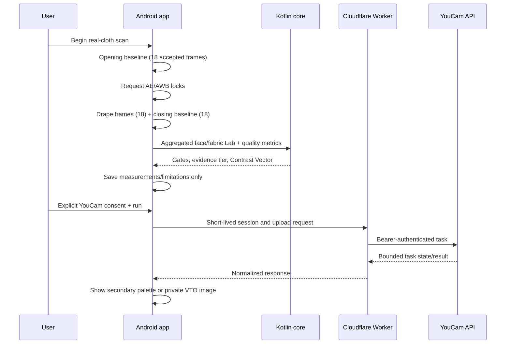
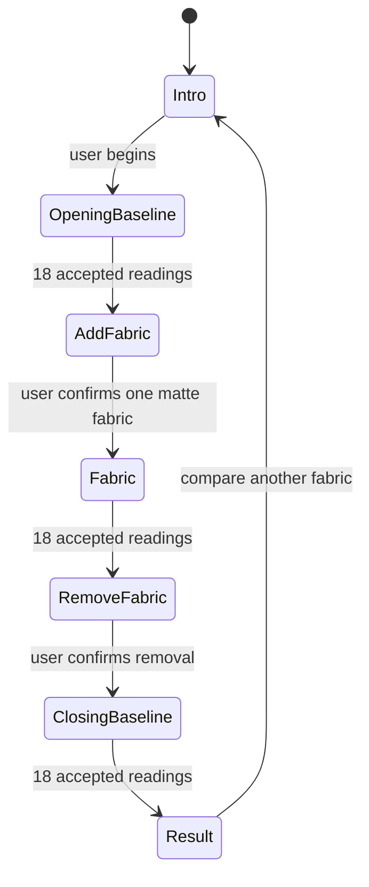

# Architecture

## System boundary

DrapeProof separates physical color evidence from generated visualization.

- The Android app owns capture, local sampling, quality gating, contrast computation, intent ranking, and evidence records.
- The Worker owns all YouCam credentials, paid-task admission, upload mediation, response normalization, and unit protection.
- YouCam Facial Color Tones is a secondary facial palette. It does not overwrite the locally captured Contrast Vector.
- YouCam Clothes V3 is the deployed preview-only provider. Generated pixels never enter measurement or ranking. A separate Scarf adapter exists in source but requires an R2 binding that is not provisioned in the live deployment.

## Android modules

### `android/core`

A pure Kotlin/JVM library with no Android dependency:

- `color/ColorModels.kt`: encoded sRGB, D65 XYZ, and CIELAB models and conversion.
- `color/ColorDifference.kt`: CIEDE2000.
- `statistics/RobustStatistics.kt`: median, MAD, quantiles, and temporal Lab summaries.
- `capture/QualityGates.kt`: deterministic thresholds and failure/warning codes.
- `domain/Contrast.kt`: three-signal Contrast Vector.
- `domain/Evidence.kt`: evidence-tier downgrade policy.
- `ranking/IntentRanker.kt`: exact-SKU percentile ranking.
- `record/DrapeRecord.kt`: full evidence schema and invariants for richer future persistence.

The Android app currently persists the smaller `LocalDrapeRecord` in `DrapeData.kt`; it records the data shown in the current UI rather than every field in the core's richer future schema.

### `android/app`

- **UI:** Jetpack Compose, portrait activity, API 26 minimum.
- **Camera:** CameraX front-camera preview and RGBA `ImageAnalysis` with keep-latest backpressure.
- **Landmarks:** MediaPipe Face Landmarker model bundled at `app/src/main/assets/face_landmarker.task`; inference runs on-device in image mode.
- **Camera control:** Camera2 interop checks AE/AWB lock capability and applies supported locks after the opening baseline.
- **Sampling:** median sRGB patches for cheeks, eyes, eyebrows, lips, under-chin, and a fabric zone below the chin; original oriented analysis frames are used rather than screenshots of the preview.
- **Storage:** `SharedPreferences` for the latest measured skin profile; app-private JSON for up to 100 lightweight Drape Records; app-private files for downloaded VTO results.
- **Networking:** dependency-free `HttpURLConnection` client. The Worker session token stays in memory; the YouCam API key never enters the APK.

The capture analyzer is deliberately conservative, but it is not a calibrated spectrophotometer. ROI geometry, camera processing, and thresholds require the two-device validation in `DEVICE_TEST_MATRIX.md`.

## Controlled capture state machine

Readings are accepted at least 140 ms apart when a face is present, the frame is sharp, the expression is neutral, both eyes are open, and sampled landmarks are unobstructed. During the drape phase, the fabric region must also be valid. Cheek/fabric ROI clipping is evaluated per phase at the session gate so a clipped background cannot deadlock collection and two clean phases cannot hide one clipped phase. Pose uses the worst absolute phase median; scale checks drape and closing phases against opening. The exact gates are documented in `EVIDENCE_MODEL.md`.

## Worker routes

| Route | Authentication | Purpose |
|---|---|---|
| `GET /healthz` | Public | Reports configured/degraded status and active VTO provider |
| `POST /v1/session` | Required judge access code + state binding | Issues a signed, short-lived bearer session |
| `GET /v1/credits` | Session | Returns protected local ledger and verified feature costs |
| `POST /v1/uploads` | Session | Returns YouCam upload tickets for the deployed Facial/Clothes paths; can return private tickets when optional Scarf/R2 is configured |
| `PUT /v1/media/:id` | Signed upload token | Optional Scarf-only route; stores a size/content-type-bound input in private R2 |
| `GET /media/:id?token=...` | Signed read token | Optional Scarf-only route; lets YouCam fetch a short-lived private input |
| `POST /v1/tasks/facial-colors` | Session | Starts YouCam Facial Color Tones |
| `POST /v1/tasks/try-on` | Session | Starts configured Scarf or Clothes V3 VTO |
| `GET /v1/operations/:operationId` | Session | Reconciles a saved paid operation without creating another task |
| `GET /v1/tasks/:feature/:taskId` | Session | Polls and normalizes task state |

The Android app sends `X-DrapeProof-Protocol: 1.0.0-alpha`. API/application versioning is currently pre-release and should be advanced together if the contract changes.

## YouCam adapters

The Worker currently implements these server-to-server paths:

- Facial file/task: `/s2s/v2.0/file/skin-tone-analysis` and `/s2s/v2.0/task/skin-tone-analysis`.
- Clothes V3 (deployed): `/s2s/v2.0/file/cloth-v3` and `/s2s/v2.0/task/cloth-v3`.
- Scarf (optional, not provisioned live): `/s2s/v2.0/task/scarf`, using `src_file_url`, `ref_file_url`, `gender`, and an allowlisted style.
- Feature-cost lookup: `/s2s/v2.0/credit/feature-cost`.

The checked-in and deployed provider is `clothes`, selected with `VTO_PROVIDER=clothes`; it uses upstream upload tickets and needs no R2 bucket. The defensive code fallback for an unset/unknown provider is `scarf`, which is healthy only when `IMAGE_STORE` is bound.

Both deployed paid paths were run successfully on 2026-07-18. Facial Color Tones cost 20 units and Clothes V3 cost 2 units. See `LIVE_VALIDATION_2026-07-18.md` for the observed results and unit reconciliation.

## Security and cost controls

- YouCam bearer key is a Worker secret and is added only to allowlisted `https://yce-api-01.makeupar.com` requests.
- HMAC-signed sessions expire in 30 minutes by default; deployment uses an independent `SESSION_SECRET`.
- Public browser origins require an exact CORS allowlist; wildcard CORS is not used. Native Android requests have no browser `Origin` header.
- Strict Zod schemas reject unknown fields, mismatched extensions, excessive JSON, invalid IDs, partial image pairs, and images at or above 10 MiB.
- Upstream responses are size-bounded and normalized; raw upstream authorization errors and headers are not forwarded.
- Paid tasks first resolve the feature's actual unit cost. Unavailable/ambiguous cost disables task creation.
- Each paid request carries a UUID-v4 operation ID bound to the exact request fingerprint. A SQLite-backed Durable Object transaction atomically admits it against the configured baseline/floor and UTC-day cap.
- Replaying an accepted operation returns the original task ID. A known rejection releases once; an indeterminate provider outcome remains reserved as `UNKNOWN_RECONCILE` and cannot be auto-retried.
- The live reconciled baseline is 1,018 units, with a 300-unit floor, per-client minute limits, and a 40-task atomic daily cap.
- `DRAPEPROOF_STATE`, `PAID_TASK_LEDGER`, and any storage binding required by the selected provider are mandatory for a ready deployment; missing state fails closed.
- R2 is not required by the deployed Clothes provider. Before switching to Scarf, provision a private bucket and verify the checked-in 24-hour `media/` lifecycle rule.

## Build-time environments

`DRAPEPROOF_API_BASE_URL` is a Gradle property. Use an HTTPS Worker URL for judge/release builds. The main manifest forbids cleartext traffic. A debug-only manifest permits `http://10.0.2.2` for an Android emulator connected to local Wrangler; that exception is not packaged into release.

## Known pre-submission boundaries

- The Worker and both YouCam task types are live-verified; physical Android execution is still pending.
- The OnePlus Nord CE6 and Samsung Galaxy F15 camera-control behavior has not yet been recorded.
- The demo catalog is not retailer inventory and its hex values are not physical spectrometer measurements.
- The current app has no in-app “delete all” control; uninstalling or clearing app storage removes local records/results.
- Textures, gloss, translucency, patterns, and multi-illuminant color constancy are outside MVP scope.
