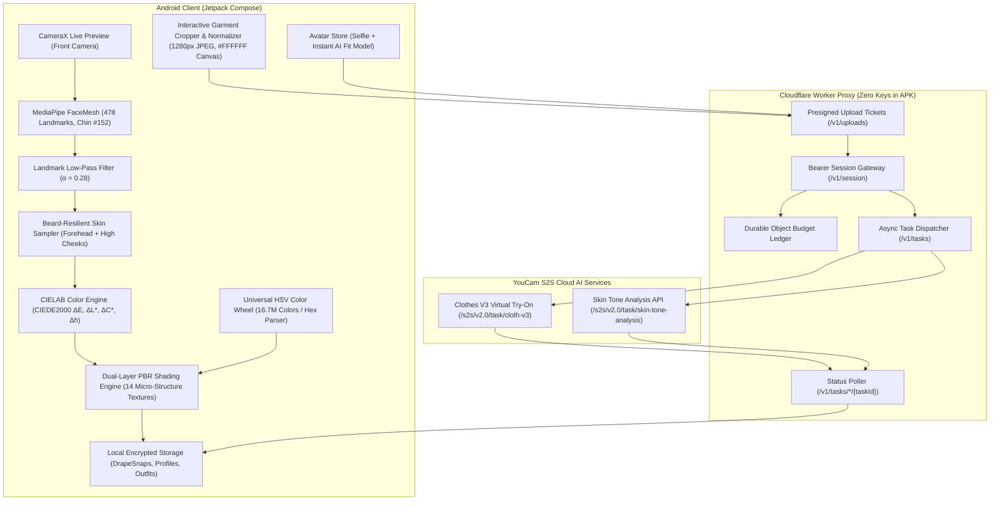

# DrapeIt — System Architecture & Data Flow

**Version:** 2.0  
**Target:** Android (API 26+)  
**Stack:** Kotlin, Jetpack Compose, CameraX, MediaPipe Tasks Vision, YouCam S2S Cloud AI, Cloudflare Workers

---

## 1. High-Level System Architecture



---

## 2. On-Device Real-Time Colorimetry Loop

```
Camera Frame (CameraX Preview)
    │
    ▼
MediaPipe FaceMesh (478 Landmarks)
    │
    ├─► Forehead Region (Landmarks 10, 151, 9, 8) ────────┐
    ├─► Left High-Cheek (Landmarks 118, 119) ─────────────┤
    ├─► Right High-Cheek (Landmarks 347, 348) ────────────┤
    └─► Nasal Bridge (Landmarks 6, 197) ──────────────────┤
                                                          ▼
                                            Texture Variance Filter
                                            (Rejects facial hair / stubble)
                                                          │
                                                          ▼
                                            Luminance Outlier Trimming
                                            (Rejects specular highlights / deep shadows)
                                                          │
                                                          ▼
                                            CIELAB Trimmed Median Calculation
                                                          │
                                                          ▼
                                            Skin Color Vector (L*, a*, b*)
                                                          │
                                                          ▼
                                            CIEDE2000 Distance & Harmony Metric
```

---

## 3. Dual-Layer PBR Fabric Shading Pipeline

To provide realistic textile rendering without running heavy 3D mesh engines over the CameraX preview, DrapeIt executes a **4-pass luminance-preserving composite** using pure Compose Canvas APIs and repeating `ImageShader` tiles:

```
User Color Input (#HEX) + Fabric Preset (1 of 14) + Head Yaw Angle
    │
    ├─► [Pass 1] Solid Base Color Fill
    │            Draws tailored polygon on chest with optional sheer alpha (Chiffon).
    │
    ├─► [Pass 2] Luminance-Preserving Micro-Weave Overlay
    │            Samples 512x512 tileable bump map from res/drawable-nodpi/
    │            using ImageShader(TileMode.Repeated) with BlendMode.Overlay / Hardlight.
    │            (Preserves fiber highlights and shadow valleys without crushing color).
    │
    ├─► [Pass 3] Anatomical Chest Curvature Depth
    │            Applies radial gradient from neck center with BlendMode.Multiply
    │            (Simulates ambient occlusion around chest and collar).
    │
    ├─► [Pass 4] Dynamic Motion-Responsive Specular Sheen
    │            Anisotropic light sweep position computed from head yaw / tilt.
    │            Blended with BlendMode.Overlay (Silk, Satin, Leather).
    │
    └─► [Pass 5] Velvet Inverted Fresnel Sheen
                 Rim lighting across polygon boundaries with BlendMode.Screen.
```

---

## 4. Garment Preparation & Normalization Pipeline

When users upload product screenshots or photos for YouCam Clothes V3 try-on:

1. **Interactive Crop Viewport:** The user zooms, pans, or rotates the image within a 3:4 aspect bounding frame in `GarmentCropperModal.kt`.
2. **Background Flattening:** The cropped garment is rendered onto an off-screen `1024x1280` canvas with a solid white background (`#FFFFFF`) and 5% padding. Solid neutral backgrounds significantly improve YouCam's edge-detection and cloth segmentation.
3. **Downsampling & Compression:** Images exceeding 1280px on their longest edge are scaled down with bilinear filtering and compressed as 88% quality sRGB JPEG on `Dispatchers.Default` before transmission.

---

## 5. Security & Privacy Architecture

* **Zero Master Keys in APK:** The Android client communicates strictly with the Cloudflare Worker gateway using short-lived session tokens (`POST /v1/session`). Master YouCam API credentials never enter the mobile binary.
* **On-Device Confidentiality:** Camera video streams, raw frames, and facial landmarks remain 100% on-device in volatile memory. Network calls occur only when a user explicitly initiates an AI Virtual Try-On or Skin Tone calibration task.
* **State & Quota Ledger:** The Worker uses a SQLite-backed Durable Object (`PAID_TASK_LEDGER`) to verify credit balance and enforce quota floors before calling upstream endpoints.
